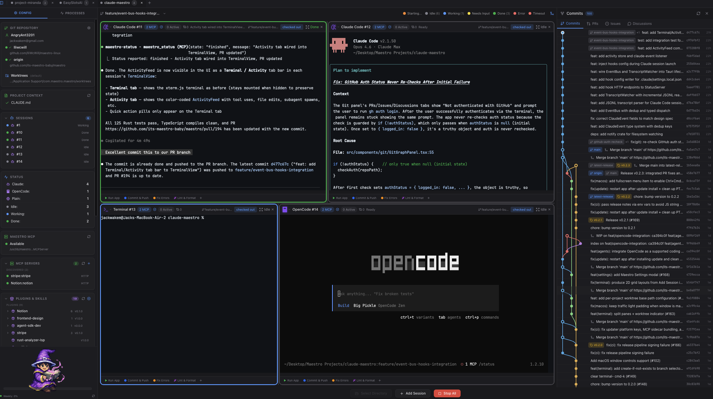

# Maestro

<!-- Add your banner: save as assets/banner.png -->


**Orchestrate multiple AI coding assistants in parallel**



A cross-platform desktop application that lets you run 1-6 Claude Code (or other AI CLI) sessions simultaneously, each in its own isolated git worktree.


[](https://x.com/maestro5240871)
[](https://discord.gg/3tQyFUYPVP)

[](https://its-maestro-baby.github.io/maestro/)

**Star us on GitHub — your support motivates us a lot!**

---

## Table of Contents

- [Why Maestro?](#why-maestro)
- [Features](#features)
- [Keyboard Shortcuts](#keyboard-shortcuts)
- [Architecture](#architecture)
- [Installation](#installation)
- [Usage](#usage)
- [Configuration](#configuration)
- [Troubleshooting](#troubleshooting)
- [Contributing](#contributing)
- [License](#license)
- [Acknowledgments](#acknowledgments)

---

## Why Maestro?

**The Problem:** AI coding assistants work on one task at a time. While Claude works on Feature A, you wait. Then you start Feature B. Then you wait again. Context switching is expensive, and your development velocity is bottlenecked by serial execution.

**The Solution:** Run multiple AI sessions in parallel. Each session gets its own:
- Terminal instance with full shell environment
- Git worktree for complete code isolation
- Assigned branch for focused work
- Port allocation for web development

### Core Principles

| Principle | Description |
|-----------|-------------|
| **Parallel Development** | Launch 1-6 AI sessions simultaneously. Work on feature branches, bug fixes, and refactoring all at once. |
| **True Isolation** | Each session operates in its own git worktree. No merge conflicts, no stepping on each other's changes. |
| **AI-Native Workflow** | Built specifically for Claude Code, Gemini CLI, OpenAI Codex, and other AI coding assistants. |
| **Cross-Platform** | Runs on macOS, Windows, and Linux with native performance. |

---

## Features

### Multi-Terminal Session Grid
- Dynamic grid layout (1x1 to 2x3) that adapts to your session count
- iTerm2-style split panes within each session (Cmd+D vertical, Cmd+Shift+D horizontal)
- Real-time status indicators: idle, working, waiting for input, done, error
- Per-session mode selection (Claude Code, Gemini CLI, OpenAI Codex, Plain Terminal)

### Git Worktree Isolation
- Automatic worktree creation at `~/.claude-maestro/worktrees/`
- Each session works on its own branch without conflicts
- Worktrees are pruned on session close
- Visual branch assignment in the sidebar
- "Worktree" badge in the terminal header when a session is running in a worktree

### MCP Server Integration
- Built-in MCP server for agent status reporting
- AI sessions report their state (idle, working, needs input, finished, error)
- Real-time status updates displayed in the session grid
- Uses the `maestro_status` tool for state communication

### Visual Git Graph
- GitKraken-style commit visualization
- Branch relationship view with colored rails
- Commit detail panel with diffs
- See which sessions are working on which branches

### Quick Actions
- Custom action buttons per session
- "Run App", "Commit & Push", and custom prompts
- Execute commands via AI assistant

### Appearance Settings
- Light and dark theme support
- Terminal font customization with support for:
  - System-installed fonts
  - Nerd Fonts (icons and glyphs)
  - Custom fonts
- Adjustable text size for terminal display

### Multi-AI Support
- **Claude Code** - Anthropic's Claude in the terminal
- **Gemini CLI** - Google's Gemini AI
- **OpenAI Codex** - OpenAI's coding assistant
- **Plain Terminal** - Standard shell without AI

### Plugin Marketplace
- Browse and install plugins from marketplace sources
- Plugin types: Skills, Commands, and MCP servers
- Per-session plugin configuration
- Automatic symlink management for commands and skills
- Extend Maestro's capabilities with community plugins

---

## Keyboard Shortcuts

| Shortcut | Action |
|----------|--------|
| **Cmd+T** | Add new terminal session |
| **Cmd+D** | Split pane vertically |
| **Cmd+Shift+D** | Split pane horizontally |
| **Cmd+W** | Close focused pane |
| **Cmd+1-9** | Jump to terminal 1-9 |
| **Cmd+[** / **Cmd+]** | Cycle previous / next terminal |
| **Cmd+K** | Clear terminal scrollback |
| **Cmd+C** | Copy selection (SIGINT if no selection) |
| **Cmd+=** / **Cmd+-** | Zoom in / out |
| **Cmd+0** | Reset zoom |
| **Shift+Enter** | Newline without executing |
| **Cmd+Left** / **Cmd+Right** | Jump to line start / end |
| **Cmd+Backspace** | Delete to line start |
| **Escape** | Exit zoom mode |

> **Note:** Cmd = Ctrl on Windows/Linux

---

## Architecture

```
┌─────────────────────────────────────────────────────────────────┐
│                    Claude Maestro (Tauri)                       │
│                                                                 │
│  ┌──────────────┐  ┌──────────────┐  ┌──────────────┐          │
│  │  Session 1   │  │  Session 2   │  │  Session 3   │   ...    │
│  │ Claude Code  │  │ Gemini CLI   │  │  Terminal    │          │
│  │ feature/auth │  │ fix/bug-123  │  │    main      │          │
│  └──────┬───────┘  └──────┬───────┘  └──────┬───────┘          │
│         │                 │                 │                   │
│  ┌──────▼─────────────────▼─────────────────▼───────┐          │
│  │              ProcessManager (Rust)               │          │
│  │     ~/.claude-maestro/worktrees/{repo}/{branch}  │          │
│  └──────────────────────────────────────────────────┘          │
│                                                                 │
│  Frontend: React + TypeScript + Tailwind CSS                    │
│  Backend: Rust + Tauri                                          │
└─────────────────────────────────────────────────────────────────┘
                              │
                              │ MCP Protocol (stdio)
                              ▼
┌─────────────────────────────────────────────────────────────────┐
│                    MCP Server (Rust)                            │
│                                                                 │
│  ┌─────────────────────────────────────────────────────────────┐│
│  │                     StatusManager                           ││
│  │  maestro_status tool - agents report their current state    ││
│  │  (idle, working, needs_input, finished, error)              ││
│  └─────────────────────────────────────────────────────────────┘│
└─────────────────────────────────────────────────────────────────┘
```

### Technology Stack

| Component | Technology |
|-----------|------------|
| Desktop App | Tauri 2.0, Rust |
| Frontend | React, TypeScript, Tailwind CSS |
| Terminal Emulator | xterm.js |
| MCP Server | Rust |
| Git Operations | Native git CLI |

---

## Installation

### Requirements

- **Node.js** 18+ and npm
- **Rust** 1.78+ (for building from source) - install via [rustup](https://rustup.rs/), not system packages
- **Git** (for worktree operations)

#### Platform-Specific Prerequisites

**macOS** (13 Ventura or later):
```bash
# Install Xcode Command Line Tools
xcode-select --install
```

**Windows** (10 or later):
- Install [Visual Studio Build Tools](https://visualstudio.microsoft.com/visual-cpp-build-tools/) with the **"Desktop development with C++"** workload
- Install [Rust](https://rustup.rs/)
- WebView2 Runtime is required (pre-installed on Windows 10 21H2+ and Windows 11; [download here](https://developer.microsoft.com/en-us/microsoft-edge/webview2/) for older versions)

**Linux** (Ubuntu 24.04 LTS / Debian):
```bash
# Install Rust via rustup (Ubuntu 24.04's apt packages ship Rust 1.75, which is too old)
curl --proto '=https' --tlsv1.2 -sSf https://sh.rustup.rs | sh
source "$HOME/.cargo/env"

# Install required system dependencies
sudo apt-get update
sudo apt-get install -y build-essential pkg-config libssl-dev \
  libwebkit2gtk-4.1-dev libayatana-appindicator3-dev librsvg2-dev \
  libfontconfig1-dev patchelf
```

> **Note:** On Ubuntu 24.04, use `libayatana-appindicator3-dev` instead of `libappindicator3-dev` to avoid package conflicts.

**Linux** (Fedora):
```bash
sudo dnf install gcc-c++ pkg-config openssl-devel \
  webkit2gtk4.1-devel libappindicator-gtk3-devel librsvg2-devel
```

**Linux** (Arch):
```bash
sudo pacman -S base-devel pkgconf openssl \
  webkit2gtk-4.1 libappindicator-gtk3 librsvg
```

### Build from Source

1. **Clone the repository:**
   ```bash
   git clone https://github.com/its-maestro-baby/maestro.git
   cd maestro
   ```

2. **Install npm dependencies:**
   ```bash
   npm install
   ```

3. **Build the MCP server:**
   ```bash
   cargo build --release -p maestro-mcp-server
   ```
   This builds the Rust MCP server binary that Tauri bundles with the application.

4. **Run in development mode:**
   ```bash
   npm run tauri dev
   ```

5. **Build for production:**
   ```bash
   npm run tauri build
   ```
   The built application will be in `src-tauri/target/release/bundle/`.

### Optional: Install AI CLIs

```bash
# Claude Code (recommended)
npm install -g @anthropic-ai/claude-code

# Gemini CLI
npm install -g @google/gemini-cli

# OpenAI Codex
npm install -g @openai/codex
```

---

## Usage

### Quick Start

1. **Launch Claude Maestro**
2. **Select a project directory** (ideally a git repository)
3. **Configure sessions** in the sidebar:
   - Set the number of terminals (1-6)
   - Choose AI mode for each session
   - Assign branches to sessions
4. **Click "Launch"** to start all sessions
5. Each session opens in its own worktree with the AI ready to work

### Session Management

- **Add sessions:** Click the floating `+` button
- **Close sessions:** Click the `×` on the session header
- **Change mode:** Use the mode dropdown in the session header
- **Assign branch:** Select from the branch dropdown

### Git Worktree Isolation

When you assign a branch to a session:
1. Maestro creates a worktree at `~/.claude-maestro/worktrees/{repo-hash}/{branch}`
2. The session's terminal opens in that worktree
3. All file changes are isolated to that worktree
4. Worktrees are cleaned up when sessions close

### Quick Actions

Each session can have quick action buttons:
- **Run App** - Tells the AI to run the application
- **Commit & Push** - Tells the AI to commit and push changes
- **Custom** - Configure your own prompts

---

## Configuration

### MCP Configuration

Copy the example configuration and update paths:
```bash
cp .mcp.json.example .mcp.json
```

Edit `.mcp.json` to configure the MCP server for agent status reporting.

---

## Troubleshooting

### Claude Command Not Found

The Claude CLI must be installed globally and in your PATH:
```bash
npm install -g @anthropic-ai/claude-code
which claude  # Should show the path
```

### Worktree Issues

If worktrees get into a bad state:
```bash
# List all worktrees
git worktree list

# Remove a specific worktree
git worktree remove /path/to/worktree --force

# Prune stale worktree entries
git worktree prune
```

### Build Issues

If you encounter build issues:
```bash
# Clear all Rust build caches
rm -rf src-tauri/target
rm -rf maestro-mcp-server/target

# Clear node modules and reinstall
rm -rf node_modules
npm install

# Rebuild MCP server first, then Tauri app
cargo build --release -p maestro-mcp-server
npm run tauri build
```

---

## Contributing

### Development Setup

1. Fork and clone the repository
2. Install npm dependencies: `npm install`
3. Build the MCP server: `cargo build --release -p maestro-mcp-server`
4. Run in dev mode: `npm run tauri dev`
5. Make your changes
6. Test thoroughly with multiple sessions

### Project Structure

```
maestro/
├── src/                     # React/TypeScript frontend
│   ├── components/          # UI components
│   ├── lib/                 # Utility libraries
│   └── App.tsx              # Main application
├── src-tauri/               # Tauri Rust backend
│   ├── src/
│   │   ├── commands/        # Tauri command handlers
│   │   ├── core/            # Core business logic
│   │   └── lib.rs           # Main Rust entry point
│   ├── Cargo.toml           # Rust dependencies
│   └── tauri.conf.json      # Tauri configuration
├── maestro-mcp-server/      # Rust MCP server (bundled with app)
│   ├── src/
│   │   └── main.rs          # MCP server entry point
│   └── Cargo.toml           # MCP server dependencies
├── Cargo.toml               # Workspace configuration
├── package.json             # Node.js dependencies
└── README.md
```

---

## License

MIT License - see [LICENSE](LICENSE) for details.

---

## Acknowledgments

- [Tauri](https://tauri.app/) - Cross-platform desktop framework
- [xterm.js](https://xtermjs.org/) - Terminal emulator for the web
- [Model Context Protocol](https://modelcontextprotocol.io/) - MCP SDK
- [Claude Code](https://claude.ai/claude-code) - AI coding assistant

---

Built with Love by Jack
